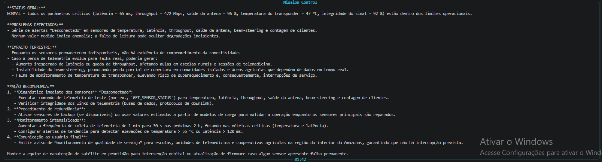
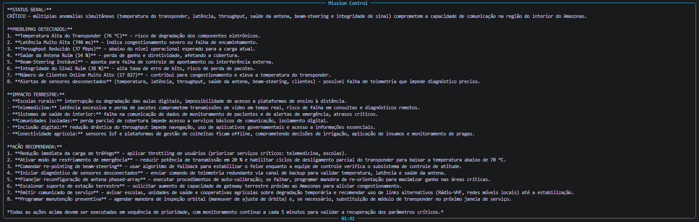

# controle-de-missao-ia
Desenvolvimento de um sistema de monitoramento espacial que recebe dados simulados de um satélite, detecta anomalias e analisa o estado da missão.

# Integrantes

Gustavo Araujo Ramos da Silva - RM 574156
Victor Henrique Nogueira Bezerra Azevedo de Souza - RM 570021
Carlos Henrique - RM 573334

# Tema

# Mission Control AI — ConnectSat

Sistema inteligente de monitoramento orbital com IA generativa voltado para conectividade rural via satélite.

Desenvolvido para a Global Solution 2026.1 da FIAP, o projeto simula uma central de operações espacial responsável por monitorar telemetria de satélites LEO (Low Earth Orbit), detectar anomalias operacionais e analisar impactos terrestres utilizando IA generativa.

---

# Objetivo do Projeto

O ConnectSat foi desenvolvido para simular um sistema de monitoramento de satélites de conectividade rural em órbita baixa.

A aplicação coleta dados simulados de telemetria, detecta problemas operacionais em tempo real e utiliza IA generativa para produzir análises técnicas contextualizadas, relacionando falhas orbitais com impactos reais na sociedade.

O foco principal do projeto é demonstrar como sistemas espaciais podem impactar:

* Telemedicina
* Escolas rurais
* Comunidades isoladas
* Inclusão digital
* Agricultura conectada

---

# Trilha Escolhida

📡 ConnectSat — Conectividade Rural

O projeto simula uma constelação de satélites LEO inspirada em sistemas modernos de telecomunicação orbital como Starlink e OneWeb.

Os principais parâmetros monitorados são:

* Latência uplink
* Throughput da rede
* Saúde da antena phased-array
* Beam steering
* Temperatura do transponder
* Integridade do sinal
* Quantidade de usuários ativos
* Região afetada

---

# Inteligência Artificial

O sistema utiliza:

* Ollama Cloud API
* Modelo: gpt-oss:120b

A IA é responsável por:

* Interpretar telemetria orbital
* Detectar riscos operacionais
* Classificar severidade da missão
* Gerar respostas técnicas
* Explicar impactos terrestres
* Sugerir ações corretivas

---

# Tecnologias Utilizadas

* Python 3.10+
* Ollama Cloud API
* Rich
* Prompt Toolkit
* PyFiglet
* Python Dotenv

---

# Funcionalidades

✅ Simulação de telemetria orbital
✅ Estados operacionais dinâmicos
✅ Alertas automáticos
✅ Classificação de severidade
✅ IA generativa integrada
✅ Impacto terrestre contextualizado
✅ Interface CLI estilo Mission Control
✅ Análise operacional em tempo real
✅ Sistema de resposta automatizada

---

# Estados Operacionais

O sistema simula diferentes estados da missão:

* NORMAL
* MODERADO
* CRÍTICO
* MANUTENÇÃO

Cada estado altera dinamicamente os parâmetros de telemetria para gerar cenários coerentes e realistas.

---

# Impacto Terrestre

O sistema foi projetado para conectar problemas orbitais com consequências reais para usuários terrestres.

Exemplos:

* Interrupção de telemedicina
* Instabilidade em escolas rurais
* Falhas em conectividade agrícola
* Perda de comunicação em comunidades isoladas
* Redução de acesso digital no interior

---

# Como Executar

## 1. Clonar o repositório

bash
git clone https://github.com/SEU-USUARIO/mission-control-ai

---

## 2. Entrar na pasta do projeto

bash
cd mission-control-ai

---

## 3. Criar ambiente virtual

bash
python -m venv venv

---

## 4. Ativar ambiente virtual

### Windows

bash
venv\Scripts\activate

---

## 5. Instalar dependências

bash
pip install -r requirements.txt

---

## 6. Criar arquivo `.env`

env
OLLAMA_API_KEY=sua_chave_aqui

---

## 7. Executar o sistema

bash
py main.py

---

# Demonstração do Sistema

## Banner inicial

---

## Estado operacional normal

---

## Estado operacional moderado

---

## Estado operacional manutenção

---

## Estado operacional Critico

---

# Principais Regras Operacionais

O sistema utiliza regras de negócio implementadas em Python para detectar:

* Throughput baixo
* Temperatura elevada
* Congestionamento
* Instabilidade de beam steering
* Degradação da antena
* Falhas de integridade de sinal

Além disso, o sistema gera respostas automatizadas para mitigação de problemas operacionais.

---

# Cenários Testados

✅ Operação normal
✅ Congestionamento da rede
✅ Throughput crítico
✅ Temperatura elevada
✅ Degradação da antena
✅ Instabilidade do beam steering
✅ Manutenção orbital
✅ Falha parcial de sensores

---

# Diferenciais do Projeto

* Telemetria coerente e contextualizada
* Correlação entre variáveis operacionais
* IA com linguagem técnica operacional
* Impacto terrestre contextualizado
* Estrutura inspirada em centros reais de controle orbital
* Interface CLI moderna com Rich

---

# Limitações Conhecidas

* Os dados de telemetria são simulados
* Não há conexão com hardware real
* O sistema depende de conexão com internet para uso da IA
* Algumas respostas da IA podem variar devido ao comportamento generativo do modelo

---

# Vídeo de Demonstração

Link do vídeo no YouTube:
[COLOCAR LINK AQUI DEPOIS]

---

# Global Solution 2026.1

Projeto desenvolvido para a disciplina de:

**Prompt Engineering and Artificial Intelligence — FIAP**

Tema:
**Indústria Espacial e Impacto Terrestre**
